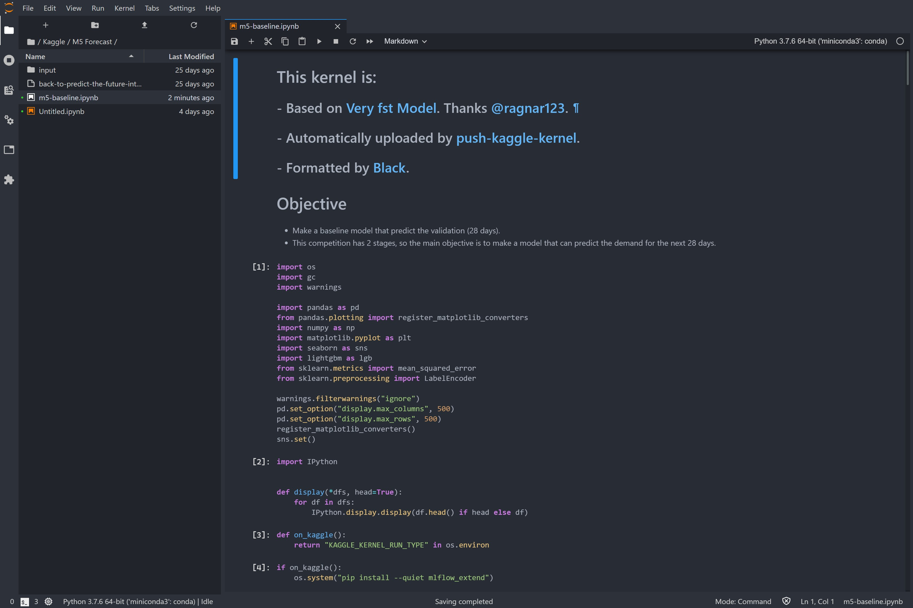

# JupyterLab Theme OneDark

An *unofficial* port of OneDark theme for JupyterLab. I noticed that many onedark ports intentionally changes the name a little bit, say `onedork`, `onehalfdark`. I don't know why but, if that's related to some license issue, please remind me to change the package name!

## Screenshot



## Notes

In my development version, the scrollbar is not themed unless I manually toggle an HTML attribute `<body data-jp-theme-scrollbars="(set to true)">`. This should not be an issue of my theme, and this switch should be enabled as long as I tick `Settings -> JupyterLab Theme -> Theme Scrollbar`. I have to see if the issue persists in the published version. 

In the screenshot, I have manually switched on this attribute, so you can see my theme configuration of the scrollbar.

## Prerequisites

* JupyterLab

## Installation

```bash
jupyter labextension install jupyterlab_theme_onedark
```

## Development

For a development install (requires npm version 4 or later), do the following in the repository directory:

```bash
npm install
jupyter labextension link .
```

To rebuild the package and the JupyterLab app:

```bash
npm run build
jupyter lab build
```
